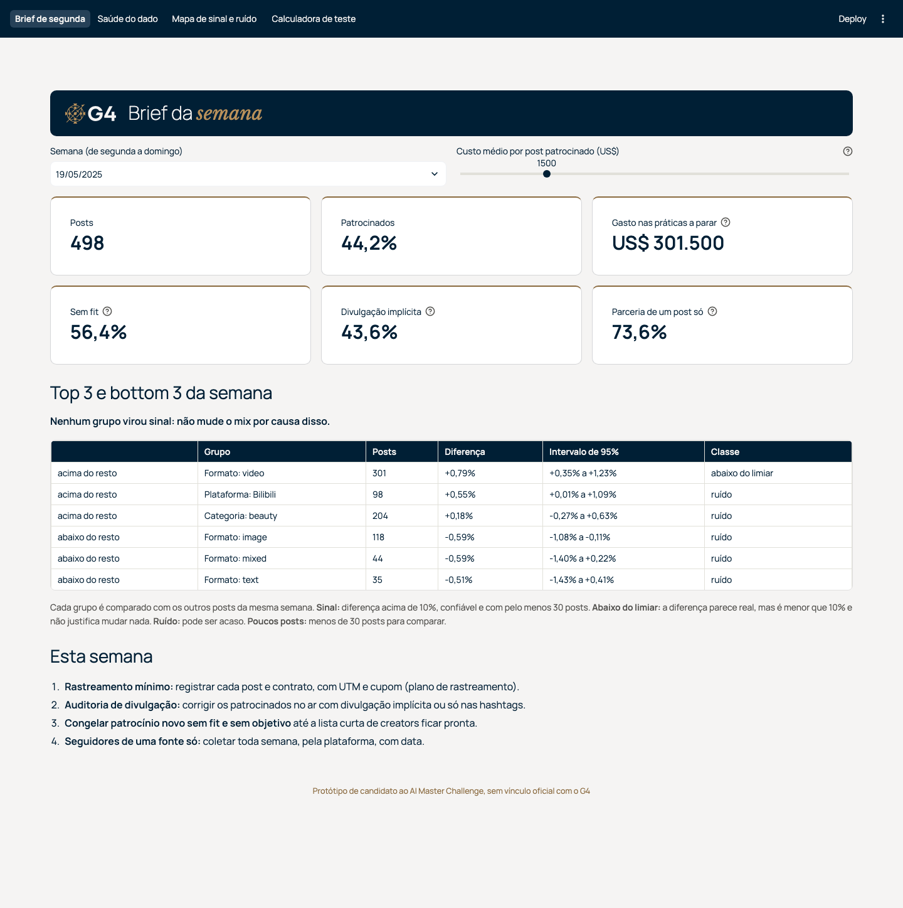

# Submissão — Guilherme Ferreira — Challenge 004

## Sobre mim

- **Nome:** Guilherme Ferreira
- **LinkedIn:** [linkedin.com/in/guiferreira91](https://www.linkedin.com/in/guiferreira91)
- **Portfólio:** [gchapolin.github.io/portfolio](https://gchapolin.github.io/portfolio/)
- **Challenge escolhido:** 004, Estratégia Social Media

---

## Executive Summary

Antes de responder o que funciona, conferi se o arquivo consegue responder, e ele não consegue: views, likes, shares e comentários se comportam como sorteio em torno de valores fixos. Nenhuma das 240 comparações de plataforma, categoria e formato chega perto do limiar de 10% (a maior diferença é 0,86%), e patrocinado rende igual a orgânico (-0,01%). O método não é o problema: numa cópia do dado com efeitos plantados, ele acha +15% em todas as rodadas e não inventa nenhum sinal em 600. O que o arquivo mostra é a operação: 94,3% dos posts patrocinados têm patrocinador sem relação com o conteúdo, divulgação implícita ou parceria de um post só. A recomendação é corrigir o patrocínio já, com cinco regras com dono, e começar a gerar o dado que falta: rastreamento imediato e três testes de tamanho calculado, um de cada vez, o primeiro nos 30 dias iniciais; o Radar de Conteúdo leva isso para a reunião de segunda-feira.

Fontes: sorteio e validação do método no [laudo](solution/01_laudo_do_dado.md) (teste 1 e §1.5); 240 comparações, 0,86% e -0,01% na [análise](solution/02_analise.md) (§2.1 e §2.2); 94,3% na [estratégia](solution/03_estrategia.md) (seção 3). As referências com § são seções de [`solution/notebooks/analise.ipynb`](solution/notebooks/analise.ipynb), que gera os números da análise; os da simulação saem de [`validacao_metodo_simulacao.py`](solution/validacao_metodo_simulacao.py).

---

## Solução

### Onde está cada coisa

| O quê | Arquivo |
|---|---|
| Laudo do dado: o arquivo consegue responder? | [`solution/01_laudo_do_dado.md`](solution/01_laudo_do_dado.md) |
| Análise: as perguntas do Head, uma a uma | [`solution/02_analise.md`](solution/02_analise.md) |
| Estratégia: o que fazer a partir de segunda-feira | [`solution/03_estrategia.md`](solution/03_estrategia.md) |
| Plano de rastreamento (9 eventos) | [`docs/plano_rastreamento.md`](docs/plano_rastreamento.md) |
| Notebook com todos os números, já executado | [`solution/notebooks/analise.ipynb`](solution/notebooks/analise.ipynb) |
| Radar de Conteúdo (aplicação) | [`solution/app/`](solution/app/) e especificação em [`docs/radar_desenho.md`](docs/radar_desenho.md) |
| Código e testes automáticos | [`solution/src/`](solution/src/) e [`solution/tests/`](solution/tests/) |
| Como a IA foi usada | [`process-log/00_COMO_LER.md`](process-log/00_COMO_LER.md) |

### Abordagem

1. **Conferir o dado antes de analisar.** Quatro testes simples e uma simulação que planta efeitos de tamanho conhecido numa cópia do dado. A simulação fica num script separado ([`validacao_metodo_simulacao.py`](solution/validacao_metodo_simulacao.py)), e nenhum número da análise vem dela.
2. **Definir a regra de sinal antes de comparar os grupos.** Só é sinal a diferença acima de 10% sobre o resto dos posts, que continua confiável depois da correção para muitas comparações (Benjamini-Hochberg) e que vem de pelo menos 30 posts. Com 52 mil posts, diferenças mínimas podem passar num teste estatístico; o limiar separa o que é real do que justifica mudar uma decisão. A regra foi fixada antes de qualquer comparação entre grupos, mas depois do perfil inicial do arquivo, que já mostrava as métricas quase constantes.
3. **Responder cada pergunta do Head separando duas camadas:** o resultado dos posts (o que rendeu) e a operação (onde, com quem e como se patrocina).
4. **Montar uma estratégia que não dependa do resultado:** regras de patrocínio com dono e métrica, o que parar de fazer, quick wins e um programa de testes com amostra calculada antes.
5. **Levar tudo para uma ferramenta de segunda-feira:** o Radar, com o visual do G4, que lê resumos gerados por script (a base bruta não entra no repositório).

### Resultados

| Pergunta do Head | Resposta curta | Fonte |
|---|---|---|
| O que gera engajamento? | Nada que o arquivo consiga medir. 0 sinais em 240 comparações; a maior diferença é 0,86%. Vídeo, a resposta "óbvia", fica em -0,03%. | análise, §2.1 |
| Patrocínio funciona? | Pelo resultado, rende igual ao orgânico: -0,01% (intervalo de -0,05% a +0,04%), comparando só posts da mesma plataforma, categoria e formato. O arquivo não tem custo, então não há ROI a calcular. | análise, §2.2 |
| Em que condições? | Nenhuma condição muda o resultado em mais de 0,1%. O que muda é o risco: patrocinador sem relação com o conteúdo em 60,1% dos casos e divulgação implícita em 47,2%. | análise, §2.2 |
| Qual audiência engaja mais? | Nenhuma. Idade, gênero e país ficam no máximo a 0,06% do resto; 204 combinações com plataforma, formato e categoria, nenhuma com sinal. | análise, §2.3 |
| O que não funciona? | Pelo resultado, nada fica abaixo do resto, e nenhum post tem engajamento zero: o arquivo não mostra fracassos. Pela operação, quatro práticas sem critério. | análise, §2.4 |
| Onde concentrar? Com que frequência? | O arquivo não sustenta concentrar em plataforma, formato, dia ou horário. São 71,4 posts por dia, e os dias com mais posts não tiveram engajamento diferente (correlação de 0,070, p = 0,06). | análise, §2.5 |

**A comparação justa não usa o tamanho do creator, de propósito.** Todos os 5.000 creators aparecem com número de seguidores diferente de um post para outro; na mediana, o maior número do mesmo creator é 13,8 vezes o menor (laudo, teste 2). Controlar por uma coluna sorteada não deixaria a comparação mais justa, então nenhuma conclusão depende dela.

**Por que confiar no "sem sinal".** Na cópia do dado com efeitos plantados, 200 rodadas por efeito (laudo, §1.5; saída em [`resultados/validacao_metodo_resumo.csv`](solution/resultados/validacao_metodo_resumo.csv)):

| Efeito plantado | Vira sinal | Outras células que viraram sinal por engano |
|---|---|---|
| +15% | 100% | 0 |
| +10% (a fronteira da regra) | 51,5% | 0 |
| +3% (real, mas pequeno demais para mudar decisão) | 0% | 0 |

**O que a operação faz sem critério** (análise, "Para decidir"; estratégia, seção 3):

| Prática | Número |
|---|---|
| Patrocinar sem relação entre patrocinador e conteúdo | 60,1% dos posts patrocinados, a mesma parcela de um sorteio |
| Divulgação implícita ou só em hashtag | 47,2% implícita; 27,4% só nas hashtags |
| Patrocínio espalhado sem foco | cerca de 43% em toda plataforma, categoria e formato; 4.979 dos 5.000 creators |
| Parcerias de um post só | 90,0% dos 18.005 patrocinadores |

**Radar de Conteúdo.** Quatro telas: o brief de segunda-feira (os 3 melhores e os 3 piores da semana por grupo, sem tratar ruído como descoberta), a saúde do dado, o mapa de sinal e ruído e a calculadora de tamanho de teste. Instruções para rodar abaixo; as outras telas estão em [`evidencias/screenshots/`](process-log/evidencias/screenshots/).



### O que vai além do baseline

A meu pedido, a IA rodou o enunciado cru num Claude sem nenhum contexto meu. Em 4 minutos, ele também concluiu que o resultado não tem sinal e que o dado parece gerado. Por isso essa conclusão não é o diferencial desta entrega. O que ela acrescenta (detalhes e fontes em [`comparacao.md`](process-log/evidencias/baseline/comparacao.md)):

| | Baseline | Esta entrega |
|---|---|---|
| Prova de que o método acharia um efeito | Não tem | Efeitos plantados numa cópia do dado: +15% vira sinal em todas as rodadas, sem nenhum sinal falso em 600 |
| Operação de patrocínio | Não olhou | 60,1% sem fit, 47,2% com divulgação implícita e 90,0% dos patrocinadores com um post só, virando cinco regras com dono |
| Tamanho do creator | Usa como controle e recomenda uma faixa de seguidores, depois de mostrar que a coluna muda a cada post | Nenhuma conclusão depende dele; vira hipótese a testar |
| Tamanho dos testes | "Entre 200 e 400 posts por grupo", sem a conta | 393 posts por grupo para detectar 20%, cerca de 4 semanas com o volume real |
| Ferramenta | Script de linha de comando | Aplicação de quatro telas para a reunião de segunda-feira |
| Process log | A IA narra decisões que ela mesma tomou | Decisões minhas, com prints e transcripts |

O baseline também fez coisas que eu não fiz, como conferir se o melhor segmento de um ano se repete no seguinte. Estão registradas na comparação.

### Recomendações

Em ordem de prioridade (estratégia, seções 2 a 6):

1. **Esta semana:** rastreamento mínimo (UTM e cupom por post), auditoria de divulgação dos posts no ar, congelamento de patrocínio novo sem fit e sem objetivo, e seguidores coletados de uma fonte só.
2. **Política de patrocínio, com dono para cada regra:** fit antes de tamanho (parcerias), divulgação explícita (jurídico e social), foco com objetivo e meta registrados antes de ir ao ar (Head de Marketing), parceria recorrente com remuneração híbrida (parcerias) e nada no ar sem rastreamento (dados).
3. **Parar de fazer** as quatro práticas acima. Parar não é cortar o orçamento: o mesmo dinheiro passa a ir para patrocínios com fit, divulgação correta, contrato recorrente e rastreamento.
4. **Três testes, um de cada vez**, na ordem da nota ICE: H1, patrocinar só conteúdo compatível (7,0); H2, segundo post do mesmo patrocinador (6,0); H3, portfólio de creators micro e nano (5,7). Cada um procura efeitos de 20% ou mais: 393 posts por grupo, cerca de 4 semanas com o volume atual de 214 posts patrocinados por semana. O H1 cabe nos primeiros 30 dias; H2 e H3 vêm em seguida. Procurar 10% levaria cerca de 15 semanas por teste (notebook, §3).
5. **Ritual de 30 minutos toda segunda-feira** com o Radar.

### Limitações

- O arquivo se comporta como dado gerado por sorteio (laudo). Nada aqui diz o que funcionaria com os dados reais da empresa. O que a entrega sustenta é o método, o diagnóstico da operação, dentro da história do desafio, e o plano para gerar o dado que falta.
- O arquivo não tem custo. O gasto estimado usa uma premissa minha, US$ 1.500 por post patrocinado (de US$ 500 a US$ 5.000), ajustável no Radar.
- O mapa de fit entre patrocinador e conteúdo é premissa. Outro mapa mudaria o 60,1%, mas não a conclusão: patrocinador e conteúdo são independentes no arquivo (p = 0,70, laudo, teste 3).
- A conta de amostra supõe coeficiente de variação 1 para as métricas de venda até o rastreamento medir o valor real.
- O Radar lê resumos do arquivo do desafio. Com dado real no mesmo formato, os resumos são regerados pelo script [`gerar_resumos.py`](solution/gerar_resumos.py).
- O Radar não foi publicado online. Roda local com um comando (seção abaixo).

---

## Como rodar

Python 3.12, a partir desta pasta.

```bash
python3.12 -m venv .venv
source .venv/bin/activate
pip install -r requirements.txt
```

**Radar e testes** (não precisam do CSV; o Radar lê os resumos que estão no repositório):

```bash
streamlit run solution/app/radar.py
python -m pytest
```

**Análise completa.** Baixe o CSV do [Kaggle](https://www.kaggle.com/datasets/omenkj/social-media-sponsorship-and-engagement-dataset) e salve como `solution/data/social_media_dataset.csv` (a base não vai para o repositório). Depois:

```bash
python solution/validacao_metodo_simulacao.py
jupyter nbconvert --to notebook --execute --inplace solution/notebooks/analise.ipynb
python solution/gerar_resumos.py
```

---

## Process Log — Como usei IA

O guia para quem não é da área técnica está em [`process-log/00_COMO_LER.md`](process-log/00_COMO_LER.md). O diário por fase está em [`process-log/DIARIO.md`](process-log/DIARIO.md); as minhas decisões, com as minhas falas citadas, em [`process-log/DECISOES.md`](process-log/DECISOES.md), montado pela IA a partir dos transcripts, que aprovei usar no lugar de um texto meu; e as skills usadas em cada etapa, com o vault do Obsidian e o motivo de usar grafos, em [`process-log/SKILLS.md`](process-log/SKILLS.md).

### Ferramentas usadas

| Ferramenta | Para que usei |
|---|---|
| Claude Code (app desktop), modelo Claude Opus 5.5 | Pesquisa do desafio, primeiro plano, análise, código com testes, textos e o Radar |
| Claude Fable 5.1, na sessão de pesquisa | Revisão crítica do primeiro plano (achou 9 falhas) e o plano refeito com as skills de marketing, que foi o executado |
| Subagentes do Claude Code | Leitura das reviews públicas do avaliador e das submissões anteriores; revisão final independente do Radar |
| Claude Code em modo seguro, sem nenhum contexto meu | Baseline: o enunciado cru e o CSV |
| Skills de marketing (influencer-marketing, ab-testing, analytics, social, content-strategy) | Referências da estratégia: faixas de creator, divulgação, formato das hipóteses, nota ICE, tamanho de amostra, plano de rastreamento |
| Skills de processo (brainstorming, writing-plans, executing-plans, test-driven-development) e dataviz | Desenho, plano e execução do Radar, com os testes escritos antes do código; gráficos |
| Skill save-session, do meu setup de notas com o Obsidian | Passar o plano e as decisões da sessão de pesquisa para a de execução, por uma nota de sessão |
| Chrome sem janela, controlado por script | Prints das telas do Radar |

### Workflow

1. **Pesquisa (sessão 0, cerca de 1 hora).** Pedi à IA para ler o repositório, os PRs e as 176 reviews públicas do avaliador, e usei a síntese dela como critério de qualidade. Pedi um plano, pedi a outro modelo para achar as falhas dele (achou 9) e mandei refazer com as skills de marketing. Os números deste workflow saem dos transcripts.
2. **Execução (sessão 1, cerca de 8 horas no relógio, das quais 1h40 parada por erro de conexão com a API), em fases.** Ambiente, baseline, laudo do dado, análise, estratégia, Radar e fechamento. Em cada fase, a IA parou nas decisões que o plano marcava como minhas, e cada fase terminou com testes passando, um commit e uma entrada no diário.
3. **Conferência.** Cada número dos documentos foi procurado na saída do notebook antes do commit. O Radar foi conferido na tela, em modo claro, escuro e na largura de celular, e revisado por outra instância do Claude que não participou da implementação.

**Iterações, até a abertura do PR:** 20 mensagens minhas, 17 rodadas de perguntas de decisão (31 perguntas) e 30 commits. Durações e contagens medidas nos [transcripts](process-log/evidencias/transcripts/) e no histórico do git.

### Onde a IA errou e como corrigi

Em cada item, quem pegou o erro: eu, um teste automático, a própria IA ao conferir o trabalho ou a revisão independente.

- **Um achado falso no plano.** O plano da IA dizia que 95% dos posts eram de creators com 50 mil seguidores ou mais. O laudo mostrou que o número de seguidores é sorteado a cada post. Ao decidir a tese, tirei o achado (diário, fase 2).
- **A regra implementada diferente da definida.** A IA escreveu "10% ou mais" onde o plano diz "mais de 10%". Um teste de fronteira, escrito antes do código, pegou (diário, fase 2).
- **Uma promessa do plano desmentida.** O plano dizia que um efeito de +10% "deve ser encontrado". A simulação mostrou 51,5%, porque 10% é a própria fronteira. Decidi manter o efeito e explicar a fronteira (diário, fase 2).
- **Uma conta que só valia para grupos grandes.** A própria IA viu, ao revisar o laudo, que "nenhum grupo difere em mais de cerca de 1%" não valia para grupos pequenos. A frase saiu (diário, fase 2).
- **Uma premissa de custo sem base.** A IA mostrou que o custo por faixa de creator do plano daria cerca de US$ 281 milhões, calculados sobre seguidores sorteados. Escolhi uma premissa única e ajustável (diário, fase 4).
- **Telas quebradas que os testes não pegavam.** Ao conferir o Radar na tela, a IA viu que, com o sistema em modo escuro, controles e tabelas ficavam ilegíveis, e que números ficavam cortados. Os filtros do mapa, que vazios ficavam ruins, fui eu que vi e mandei refazer, duas vezes (diário, fase 5).
- **Quatro problemas importantes na revisão independente.** Outra instância do Claude achou tabelas escondendo uma coluna no celular, ícones sumindo no modo escuro, o brief quebrando com dado de outro formato e a semana padrão diferente da especificação. Cada correção teve um teste escrito antes ou uma medição na tela antes e depois (diário, fase 5).
- **Um baseline contaminado.** A primeira tentativa rodou como subagente da sessão de trabalho e herdou as instruções do projeto, que descrevem o método. A IA percebeu, parou o agente e refez em modo seguro, sem contexto (diário, fase 1).

### O que eu adicionei que a IA sozinha não faria

- Usei as reviews públicas do avaliador como critério de qualidade e mandei revisar o plano com outro modelo antes de escrever qualquer código.
- Escolhi o limiar mais exigente, 10%, quando a IA recomendava 5%, antes de rodar qualquer comparação entre grupos.
- Quando o laudo derrubou parte do plano, decidi a tese de duas camadas: "Resultado: sem sinal. Operação: sem critério."
- Escolhi o que entra no "parar de fazer", o mapa de fit, a premissa de custo, a ordem dos testes, os donos das regras e o efeito mínimo de 20% para caber em 30 dias.
- Defini a UX do Radar a partir do site do G4 e rejeitei, olhando a tela, o que ficou ruim.

---

## Evidências

- [x] Screenshots das conversas com IA: [`process-log/evidencias/screenshots/`](process-log/evidencias/screenshots/), com as minhas respostas nas perguntas de decisão, as telas do Radar e o filtro que reprovei
- [ ] Screen recording do workflow
- [x] Chat exports: [`process-log/evidencias/transcripts/`](process-log/evidencias/transcripts/), as duas sessões em Markdown legível e em JSONL compactado
- [x] Git history: um commit por etapa na branch `submission/guilherme-ferreira`
- [x] Outro: o baseline em [`process-log/evidencias/baseline/`](process-log/evidencias/baseline/)

---

_Submissão enviada em: 25/09/2026_
